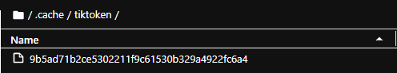
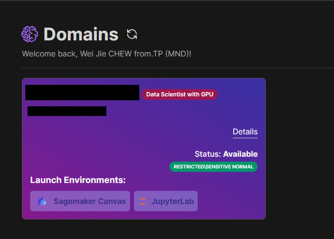
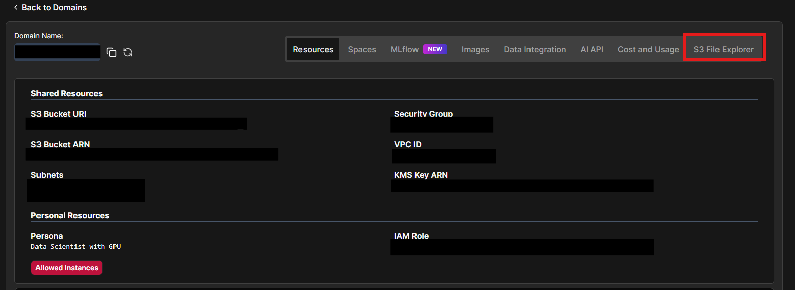
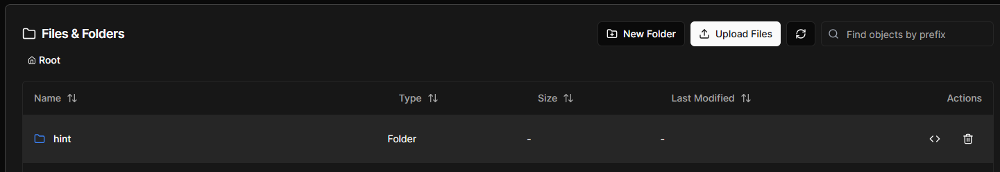
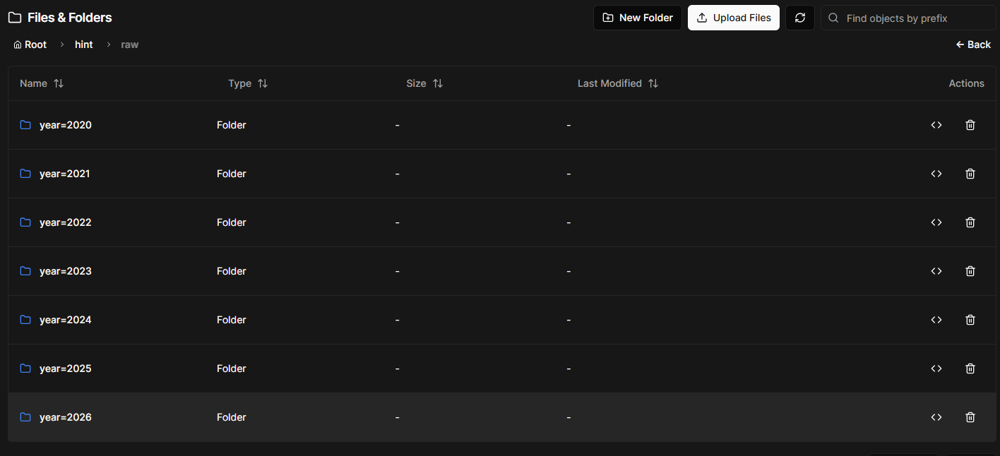
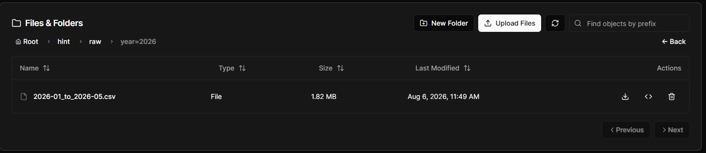

# Hint Article Preprocessing Pipeline


Polars-based ETL pipeline running on [Maestro](https://www.tech.gov.sg/products-and-services/for-government-agencies/data-and-ai/maestro/) AWS Sagemaker that turns raw housing-articles CSV into the parquet files the hint chatbot consumes. Consists of four discrete phases, each a pure parquet-in/parquet-out step.

| Phase | Command | Input | Output |
|---|---|---|---|
| 1 clean | `clean` | raw CSV | `articles_base.parquet` (one row per article) |
| 2 flatten | `flatten` | base parquet | `articles_flat.parquet` (one row per article-topic, for SQL) |
| 3 chunk | `chunk` | base parquet | `rag_chunks.parquet` (sentence-aware token chunks + retrieval_text) |
| 4 embed | `embed` | chunks parquet | `rag_chunks_embedded.parquet` (chunks + `embedding` column, list[f32]) |

All tunable constants (chunk sizes, batch size, rate limits, filenames) live
in **`pipeline/config.py`** — edit there, or use the CLI overrides, to
experiment. The embedding model and dimensions are configured via environment
variables (`EMBEDDING_MODEL`, `EMBEDDING_DIM`) — see Setup below.

## Setup
Clone the repository:
```
git clone https://github.com/happyweijie/mnd-chatbot-preprocessing
```

Setup a virtual environment (optional) and install all dependencies.
```bash
python -m venv .venv
source .venv/bin/activate
python -m pip install -r requirements.txt
```

Setup Environment variables:

```bash
export OPENAI_API_KEY=sk-...
export OPENAI_BASE_URL=xxxx
export EMBEDDING_MODEL=text-embedding-3-large

# optional argument, leave unset to use embedding model's default embedding length
export EMBEDDING_DIM=3072

# s3 bucket information for file uploads
export HINT_BUCKET=sst-s3-sst...
export HINT_S3_PREFIX=my_bucket
```

Alternatively, put them in a `.env` file (see `.env.example`) which it is loaded automatically when running the pipeline. 

Note: Leave `EMBEDDING_DIM` unset to use the model's default length (1536 for `text-embedding-3-small`, `3072` for `text-embedding-3-large`).

Extra setup on Restricted Sagemaker Enviroments: set `TIKTOKEN_CACHE_DIR` to an **absolute** path (`~` is not expanded) containing the cached cl100k_base
encoder file `9b5ad71b2ce5302211f9c61530b329a4922fc6a4`.

```bash
export TIKTOKEN_CACHE_DIR=/home/sagemaker-user/.cache/tiktoken
```

### Quick Setup using cat

Copy the command below to Notepad and update the environment variables accordingly, then paste back into Sagemaker and run.

```bash
cat << EOF > .env
OPENAI_API_KEY=sk-....
OPENAI_BASE_URL=xxxx
EMBEDDING_MODEL=text-embedding-3-large
TIKTOKEN_CACHE_DIR=/home/sagemaker-user/.cache/tiktoken

HINT_BUCKET=sst-....
HINT_S3_PREFIX=my_bucket_name
EOF
```

### Setting up a cached `tiktoken` encoder in Restricted Environments

[tiktoken](https://github.com/openai/tiktoken) is OpenAI's fast Byte Pair Encoding (BPE) tokenizer. It is used in this preprocessing pipeline to perform precise token counting before text is sent to downstream embedding models.

In particular, this pipeline uses the `cl100k_base` encoding, which is used by OpenAI's `text-embedding-3` embedding models.

By default, `tiktoken` may attempt to download the encoding data the first time an encoder is loaded. In restricted or air-gapped environments, such as a SageMaker environment without outbound internet access, this download will fail. The encoder therefore needs to be downloaded beforehand and placed in the local tiktoken cache.

#### Steps

1. Download the `cl100k_base.tiktoken` encoder file from an environment with internet access.

2. Upload the encoder file to the `tiktoken` cache directory in your SageMaker environment:

   ```text
   /home/sagemaker-user/.cache/tiktoken/
   ```

   If the `tiktoken` directory does not already exist, create it first:

   ```bash
   mkdir -p /home/sagemaker-user/.cache/tiktoken
   ```

3. Place the downloaded `cl100k_base.tiktoken` file in the `tiktoken` directory.

4. Rename the encoder file to the cache key expected by `tiktoken`:

   ```bash
   # Enter the tiktoken cache directory
   cd /home/sagemaker-user/.cache/tiktoken

   # Rename the cl100k_base encoder to its expected cache key
   mv cl100k_base.tiktoken 9b5ad71b2ce5302211f9c61530b329a4922fc6a4
   ```

   After renaming, the directory should look like:

   ```text
   /home/sagemaker-user/.cache/
   └── tiktoken/
       └── 9b5ad71b2ce5302211f9c61530b329a4922fc6a4
   ```

    You can also verify the contents of the `/.cache/tiktoken` directory using the Sagemaker file explorer. you should see this:
    
    

Once the encoder is available in the local cache, `tiktoken` can load `cl100k_base` without requiring outbound network access. This allows the preprocessing pipeline to perform token counting normally in restricted SageMaker environments.

### Uploading files to S3

Raw csv files can be uploaded to the S3 data lake by running the script or manually through Maestro S3 Explorer.

Running the script is preferred as it enforces data consistency such as ensuring no out of range articles in the dataset or datasets from overlapping months. 

#### Uploading through the script

Upload the raw csv file to Sagemaker and run the following command below. The `--batch-id` argument corresponds to the start and end month of the dataset.

> Ensure the batch id adheres to this naming convention: `2026-06` (one month) or `2026-01_to_2026-05` (inclusive month range). A dataset can span at most a single year. 

```bash
# Upload a raw csv file to the S3 bucket
# Throws an error if batch id is invalid or overlaps with existing batches
python -m pipeline upload --batch-id 2026-06 --file <path_to_file>
```

#### Uploading directly through Maestro S3 Explorer

> **Known Issue:** There are instances where some csv files cannot be uploaded manually through Maestro. In these cases, fallback to uploading through the script.

Log in to Maestro and select a domain.



In the domain dashboard, click `S3 File Explorer`, at the top right hand corner.



Before uploading the raw csv file, rename the file and ensure it adheres to this naming convention: `2026-06` (one month) or `2026-01_to_2026-05` (inclusive month range). A dataset can span at most a single year.

Visit the Maestro S3 Explorer and click on the folder (prefix) storing the datasets.



Click on the raw folder and click on the folder corresponding to the year of the dataset. For example, if your dataset is for `July 2026`, click on the folder `year=2026`. If no such folder exists, create a new folder called `year=<year>` before entering the folder.



Use the upload button to upload the raw csv file to the S3 folder. 



## Running the Pipeline

In sagemaker, activate the virtual environment if you haven't already and run:

```bash
# run full pipeline on a raw csv file stored on the s3 data lake
python -m pipeline batch --batch-id 2026-06

# run multiple batches one after another
python -m pipeline batch --batch-id 2026-06; python -m pipeline batch --batch-id 2026-07;

# run full pipeline locally on a local csv file (raw files/output not uploaded to S3)
python -m pipeline all articles.csv out/
```

## Deleting datasets with the pipeline

The pipeline can also be used to clean up the S3 data lake, allowing you to remove old batches to replace them with new ones. When deleting a batch,
both the raw csv and processed outputs will be deleted for that batch.

In Sagemaker, run:

```bash
# list all files that will be deleted by the operation.
python -m pipeline delete --batch-id 2021-01_to_2021-12

# deletes all raw csv files and processed parquet files for the batch 2021-01_to_2021-12
python -m pipeline delete --batch-id 2021-01_to_2021-12 --yes
```

## Notes

- **Article identity**: `article_id = title | YYYY-MM-DD | news_site`.
  `published_date` is truncated to day precision; the parser accepts both ISO
  (`2022-08-08T23:31:00+08:00`) and Excel-converted (`8/8/2022 23:31`) date
  formats, and fails loudly on anything else.
- **Chunking**: sentence-aware, targets 350 tokens with a 500-token cap and a
  75-token sentence overlap between chunks (a chunk can reach cap + overlap in
  rare oversized-sentence cases). Assumes single-line article content —
  guarded by assertions in phase 3.
- **Embedding**: `text-embedding-3-small` by default (override via
  `EMBEDDING_MODEL`/`EMBEDDING_DIM`), via Pydantic AI.
  Requests are paced to the gov endpoint's limits (20 req/min, 200k
  tokens/min), retried with backoff, and checkpointed — an interrupted run
  resumes from the last checkpoint instead of starting over.
- **Guard assertions**: every phase asserts data integrity (no null
  dates/titles, unique article/chunk ids, topic/sentiment consistency) and
  fails with a counted, actionable message instead of writing bad parquet.

## Tests

```bash
pip install pytest

python -m pytest tests/
```

## Project Layout

```
pipeline/
├── __main__.py        # CLI (python -m pipeline ...)
├── config.py          # all tunable constants
├── assertions.py      # shared data-integrity guards
├── chunking.py        # pure token-chunking functions
├── phase1_clean.py    # raw CSV -> articles_base.parquet
├── phase2_flatten.py  # base -> articles_flat.parquet
├── phase3_chunk.py    # base -> rag_chunks.parquet
├── phase4_embed.py    # chunks -> chunks + embedding column
├── batching.py        # batch-id parsing + non-overlap rule (see "S3 storage layout")
├── s3_upload.py       # local raw CSV -> raw/year=YYYY/<batch>.csv (python -m pipeline upload)
├── s3_batch.py        # S3 in -> all phases -> S3 out (python -m pipeline batch)
└── s3_delete.py       # remove one batch everywhere (python -m pipeline delete)
tests/                 # pytest suite (chunking, batching, S3 uploader/runner/deleter with fake S3)
notebooks/             # exploratory notebooks the pipeline was derived from
```

## S3 storage layout

This is the agreed layout for raw batches and every processed
stage. `python -m pipeline batch` writes it, the hint chatbot reads it
directly (`hint/src/config.py`, S3 mode: `processed/flattened/**/*.parquet`
and `processed/embeddings/**/*.parquet`).

```
{prefix}/                              # HINT_S3_PREFIX, e.g. teams/xyz/hint (never the bucket root)
├── raw/                               # uploaded by hand: one CSV per batch
│   ├── year=2020/2020-01_to_2020-12.csv
│   ├── ...
│   ├── year=2025/2025-01_to_2025-12.csv
│   └── year=2026/
│       ├── 2026-01_to_2026-05.csv
│       └── 2026-06.csv
└── processed/                         # written by the pipeline, one parquet per batch per stage
    ├── base/year=2026/2026-06.parquet          # phase 1  articles_base
    ├── flattened/year=2026/2026-06.parquet     # phase 2  articles_flat   (hint: SQL)
    ├── chunks/year=2026/2026-06.parquet        # phase 3  rag_chunks
    └── embeddings/year=2026/2026-06.parquet    # phase 4  rag_chunks_embedded (hint: RAG)
```

Conventions:
- **Hive-style `year=YYYY/` partition folders only**]
  if a single merged file is ever needed, add a separate compaction step.
- **Batch id = filename stem**: `2026-06` (one month) or `2026-01_to_2026-05`
  (inclusive month range).
- **One batch = one year (enforced)**: a batch file may only contain articles
  published within the range named in its filename, so it maps 1:1 to a single
  `year=` partition in every stage. Phase 1 fails fast, listing the offending
  rows, if any `published_date` falls outside the range. Cross-year deliveries
  must be split into one file per year before upload.
- **Processed files are named after their source batch**: each run writes
  `<stage>/year=YYYY/<batch>.parquet` only — append-only and idempotent;
  re-running a batch overwrites only its own files.
- **Non-overlap (enforced)**: before processing, the pipeline lists
  `raw/year=YYYY/` and parses each filename's month range; it refuses if the
  new batch's range intersects any existing file's range. Exception: an exact
  filename match is an idempotent re-run. No data is downloaded for this
  check. Together with the row-range rule this makes overlap impossible:
  filenames cannot overlap, and rows cannot escape their filename's range.
- **Lineage**: every processed row carries `batch_id` (the filename stem)
  and `year`, so a batch can be traced or selectively reprocessed.
- **Dedup** (`article_id = title | date | news_site`) is enforced within a
  batch only; a cross-batch check can be added later without changing the
  layout.
- **Replacement rule — nothing is ever deleted automatically**; humans
  delete, the pipeline only rejects.
  - New months, old data unchanged: upload the new months as a new batch
    file (e.g. `2026-06.csv`). No deletions.
  - Same batch revised (same coverage): re-upload under the **same**
    filename and reprocess — outputs are overwritten in place.
  - Superseding a batch with different coverage (e.g. `2026-01_to_2026-05`
    → `2026-01_to_2026-06`): delete the old batch **everywhere** first —
    1 raw CSV + its 4 identically named processed parquets — then upload
    and process the replacement. Deleting only the raw file leaves stale
    outputs in `processed/` and consumers would read those months twice.
- **Embedding checkpoints** (`*.checkpoint.parquet`) stay local; never under
  `processed/embeddings/`.
  